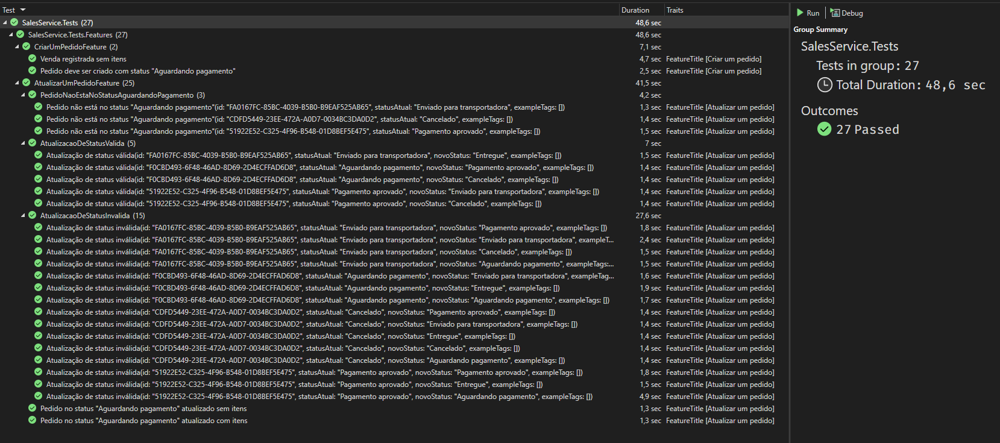

# Instruções de uso:

## Executando a aplicação:

A aplicação consiste em uma solução .NET 8 integrada com um banco de dados PostgreSQL, ambos configurados para execução em contêineres Docker. As instruções para criação das imagens e inicialização dos contêineres estão especificadas no arquivo `docker-compose.yml`.

Para hospedar os contêineres localmente, abra o terminal na raiz da solução (/SalesService) e execute o comando `docker-compose up --build`, que construirá e iniciará os serviços conforme configurado.

Para encerrar os contêineres, utilize o comando `docker-compose down`, finalizando os serviços e liberando os recursos alocados.

## Primeira execução:

### Emissão de token para autenticação:

A aplicação está protegida por autenticação via JWT em todos os seus endpoints. Para gerar um usuário e token para uso em ambiente de desenvolvimento loal, abra o terminal no diretório `/SalesService/SalesService.Api` e execute o comando `dotnet user-jwts create`. O usuário e token podem ser testados no endpoint `GET /api/v1/auth`.

Obs: esse método não funciona quando a aplicação está em contêiner. Nesse caso, deve ser gerado um token pelo endpoint `POST /api/v1/auth` com as seguintes credenciais `{"username": "admin","password":"password1234!"}`.

Para comportar os dois cenários, a validação do token está configurada de formas diferentes entre produção e desenvolvimento, o que pode ser observado nos arquivos `ServicesConfiguration.cs` e `AppFixture.cs`.

## Dados autogerados:

Como dados de representantes de vendas e de produtos são pré-requisitos para a criação de um pedido, e um pedido existente é um requisito para os casos de uso de atualização de status e alteração de itens, a aplicação verifica, durante sua inicialização, se o contêiner do banco de dados já possui registros nas tabelas correspondentes. Caso não haja registros, a aplicação realiza a inserção dos dados iniciais definidos no arquivo `/SalesService/SalesService.Persistence/InitialData.cs`, facilitando assim o uso em ambiente de desenvolvimento e garantindo que todos os dados mínimos estejam disponíveis para os cenários propostos.

## Testes automatizados:

Os testes dos casos de uso foram implementados na modalidade de integração e tem seus cenários descritos em Gherkin, vinculados à execução dos testes.

Para rodar os testes, é necessário gerar um token usando o pacote `user-jwts` como descrito anteriormente e o inserir na variável de ambiente `TestJwt` do arquivo `appsettings.Development.json`.

Como a aplicação não está integrada a um provedor de autenticação, os testes falhariam na hora de validar o metadata do token. Por isso, foi implementada uma classe que simula a validação do token `MockJwtTokens.cs`.

Cada execução de teste está isolada, gerando um novo schema no banco de dados com os dados iniciais, reduzindo a chance de testes flakies.

Foram implementados 27 cenários de teste e todos estão validando com sucesso os cenários correspondentes.



# Informações sobre decisões do projeto:

## Layered Architecture

Gosto de trabalhar com arquitetura em camadas porque ela traz um design modular para o projeto, separando as preocupações de forma organizada, o que ajuda a definir bem o papel de cada camada no fluxo de dados e operações.

Isso tende a facilitar a legibilidade e a reduzir a carga cognitiva para entender a estrutura da solução, facilitando a manutenção por profissionais de qualquer nível de experiência.

Além disso, permite que as dependências sejam introduzidas de forma controlada, ajudando a evitar dependências circulares.

## Domain Driven Design

Utilizar o DDD em um contexto de vendas destaca as entidades e ações centrais do domínio, que nesse caso são os pedidos.

Em minha experiência, essa abordagem se mostrou de grande ajuda na organização e difusão do entendimento do domínio de negócios, criando uma linguagem comum entre os stakeholders e a equipe de produto, facilitando a comunicação entre as partes e mitigando desconexões de entendimento sobre os conceitos que podem ser prejudiciais ao andamnto do projeto.

Além disso, esse alinhamento entre as partes facilita a criação de um código mais expressivo e contextualizado, pois ele passa a refletir o fluxo e as regras do domínio de forma natural, tornando a estrutura mais alinhada com as necessidades do negócio.

## Event Sourcing

Optei pela implementação de event sourcing em razão da natureza dinâmica de um domínio de vendas, onde eventos como "pedido criado", "item adicionado ao pedido" ou "status do pedido alterado" são comuns.

Como cada evento representa uma mudança de estado e é armazenado com todos os seus detalhes, essa abordagem possibilita a auditoria e reconstituição do estado do pedido em qualquer momento do seu ciclo de vida.

Em um contexto onde o controle e a rastreabilidade das operações são essenciais para a confiabilidade dos dados e conformidade com regulamentações, esse é um fator essencial.
````
